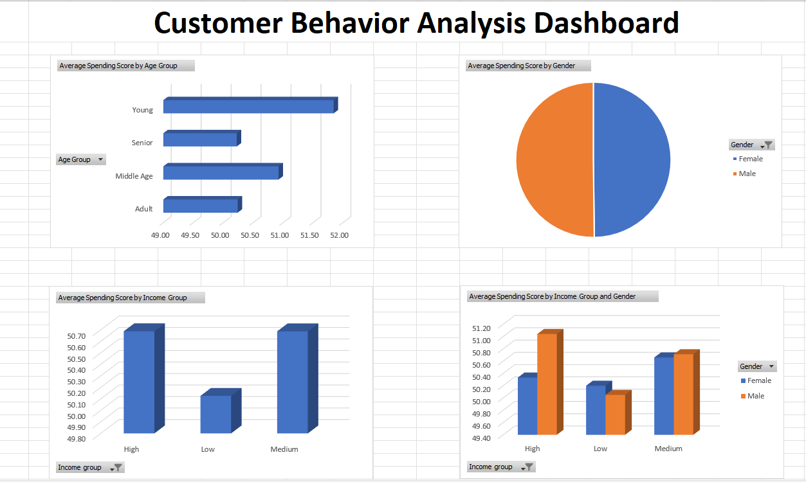

# Customer Segmentation Analysis (Excel + Python + SQL)

Built an end-to-end customer segmentation project covering data cleaning, analysis, SQL querying, and dashboard visualization.

## Overview
This project analyzes customer behavior in a shopping mall dataset to identify patterns based on age, gender, and income.

## Tools & Technologies
- Excel (Dashboard)
- Python (Pandas, Matplotlib, Seaborn)
- SQL (SQLite)

## Project Workflow
1. Data Collection – CSV dataset
2. Data Cleaning – Python
3. Feature Engineering – Age & Income groups
4. Analysis – Python & SQL
5. Visualization – Excel dashboard
6. Insights – Business recommendations

## Key Insights
- Spending is consistent across income groups
- Gender has minimal impact on spending
- Younger customers show slightly higher engagement
- Customer behavior is influenced by multiple factors

## Business Recommendations
- Target high-income customers with premium offerings
- Focus marketing on younger demographics
- Use behavioral segmentation instead of gender-based targeting
- Combine age and income for better targeting

## Dashboard


## SQL Example
```sql
SELECT Gender, AVG(`Spending Score`)
FROM customers
GROUP BY Gender;
